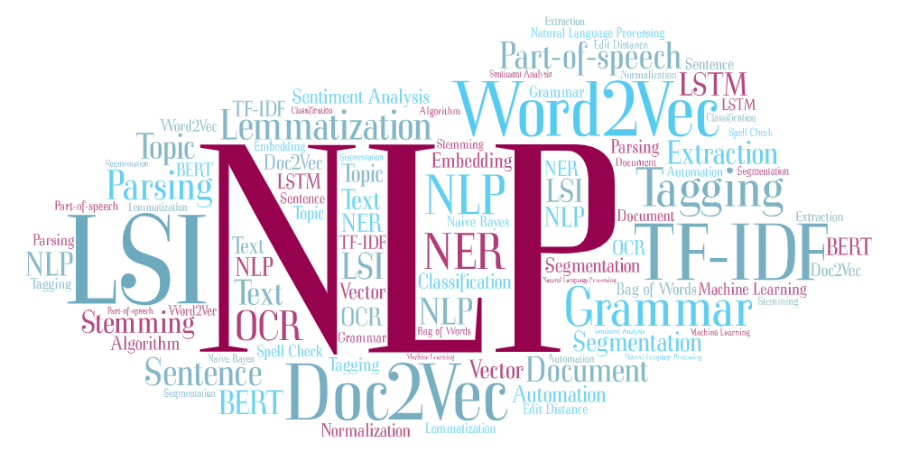

## Universal Language Model Fine-tuning for Text Classification

*An effective transfer learning method that can be applied to any task in NLP, and introduce techniques that are key for fine-tuning a language model.*

Video recording of the overview: https://youtu.be/64WLlCEOYSQ

### Introducion

Text classification is a category of Natural Language Processing (NLP) tasks with real-world applications such as spam, fraud, bot detection, emergency response, and commercial document classification, such as for legal discovery. 

In 2018, Howard and Ruder et. al. provided a novel method (ULMFiT) for fine-tuning of neural models for inductive transfer learning — given a source task in which the model is trained, the same model is to be used to obtain good performance on other NLP tasks as well. ULMFiT can be used to:

* to achieve CV-like transfer learning for any task for NLP.
* pretrain a language model (LM) on a large general-domain corpus and fine-tunes it on the target task using novel techniques.

### Method 

* **Discriminative fine-tuning** 

  Instead of using the same learning rate for all layers of the model, discriminative fine-tuning allows us to tune each layer with different learning rates. 

* **Slanted triangular learning rates**

  We would like the model to quickly converge to a suitable region of the parameter space in the beginning of training and then refine its parameters. We first linearly increases the learning rate and then linearly decays it according to an update schedule.

* **Gradual unfreezing**

  Rather than fine-tuning all layers at once, which risks catastrophic forgetting, we gradually unfreeze the model starting from the last layer as this contains the least
  general knowledge.

### Experiments

* We evaluate the method on six widely-studied datasets, used by state-of-the-art text classification and transfer learning approaches as instances of three common text classification tasks: sentiment analysis, question classification, and topic classification. 

* For each task, we compare against the current state-of-the-art.

### Results

In Table 2, we can see the method outperforms both CoVe, a state-of-the-art transfer learning method based on hyper columns, as well as the state-of-the-art on both datasets.

 Table 3 shows the test error rates on some datasets. The method again outperforms the state-of-the-art significantly.

### Future directions

* Apply the method to novel tasks and models.

* Improve language model pretraining and fine-tuning and make them more scalable.

* Perform more studies to better understand what knowledge a pretrained language model captures, how this changes during fine-tuning, and what information different tasks require.

### References

[1] Understanding ULMFiT — The Shift Towards Transfer Learning in NLP, https://towardsdatascience.com/understanding-ulmfit-and-elmo-the-shift-towards-transfer-learning-in-nlp-b5d8e2e3f664

[2] Universal Language Model Fine-Tuning (ULMFiT), https://humboldt-wi.github.io/blog/research/information_systems_1819/group4_ulmfit/

[3] Michael Nielsen, Improving the way neural networks learn, Neural Networks and Deep Learning, posted in Oct. 2018, http://neuralnetworksanddeeplearning.com/chap3.html

[4] Jeremy Howard, Lesson 10: Deep Learning Part 2 2018 - NLP Classification and Translation, [https://www.youtube.com/watch?v=h5Tz7gZT9Fo&t=4191s%5D](https://www.youtube.com/watch?v=h5Tz7gZT9Fo&t=4191s]), May 7, 2018

[5] Michael Nielsen, Improving the way neural networks learn, Neural Networks and Deep Learning, posted in Oct. 2018, http://neuralnetworksanddeeplearning.com/chap3.html